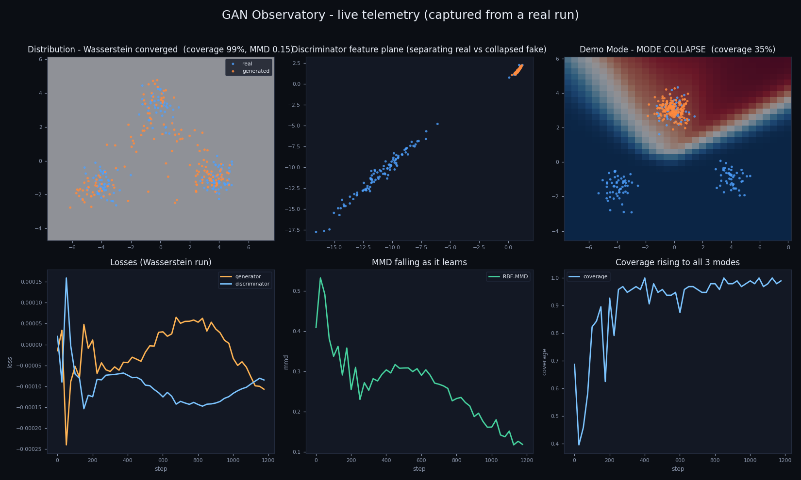

# GAN Lab TensorFlow

**A real-time, steerable GAN training observatory — plus the TensorFlow research lab underneath it.**

Most GAN repositories are static: train a model, dump a grid of images, done. This one is *live*. **GAN Observatory** streams a real GAN training loop to your browser at ~20 fps and lets you **steer it while it runs** — watch the generated distribution chase the target, watch the discriminator's decision boundary and its internal 2D feature space reshape, watch RBF-MMD fall — then drag a hyperparameter into the danger zone, trigger **mode collapse**, and rescue it. No restart.

```bash
pip install -e ".[web]"
gan-lab serve            # open http://127.0.0.1:8000
```



## 🔭 The Observatory (what makes this a real project)

| Feature | How it works |
|---|---|
| **Live training stream** | A background training thread pushes telemetry frames over a WebSocket at 20 fps; a *drop-to-latest* queue means a slow browser never back-pressures training. |
| **Discriminator X-ray** | The generated cloud sits on the discriminator's live decision-boundary heatmap, with a second panel showing the learned 2D `feature_plane` — a view almost no GAN repo has. |
| **Live quality metrics** | RBF-MMD, coverage (recall) and precision stream as sparklines, straight from the package's own `evaluation` estimators, with a **mode-collapse alarm**. |
| **Steer it mid-run** | Learning-rate slider, Vanilla↔Wasserstein swap, TTUR, discriminator-steps, and instance-noise toggles all take effect on the next step — no teardown. |
| **Deterministic Demo Mode** | One click loads a fixed-seed, deliberately unstable run that reliably collapses to a single mode — the setup for the collapse-and-rescue story. |
| **Benchmark distributions** | The 3-mode mixture, the classic **8-Gaussian ring** (a standard mode-coverage stress test), plus quadratic and sine curves. |
| **Run registry + model serving** | **Save any run** to a SQLite registry (config, seed, metric history, serialized generator), then **serve fresh samples from a saved model** over `GET /api/runs/:id/sample` — reloaded and run, no retraining. |
| **A/B derby** ([`/derby`](src/gan_lab_tensorflow/live/derby.py)) | Two GANs training on the **same target from the same seed** — identical start, only the loss differs. Watch Vanilla collapse while Wasserstein covers every mode, side by side, plus a **time-travel scrubber** to replay any point in training. |
| **Shipped** | Dockerized (CPU-only, no TensorFlow needed), tested, and gated by GitHub Actions running the full pytest suite. |

### The 60-second demo

1. Open the URL, hit **Train** — the three-mode target fills in cleanly under Wasserstein; MMD drops.
2. Click **Demo Mode**, hit **Train** — the generator **collapses onto a single mode**, coverage craters, and a **MODE COLLAPSE** banner fires.
3. **Reset → Wasserstein** — all three modes return. (Or try to claw the collapsed net back live with **Instance noise** + a lower learning rate — deep collapse only partially reverses, which is true to real GANs.)

### How it reuses the lab

The observatory is a thin real-time head on the existing package, not a rewrite:

- Target distributions come from [`data.py`](src/gan_lab_tensorflow/data.py) (`sample_curve`, `sample_mixture`).
- Live metrics come from [`evaluation.py`](src/gan_lab_tensorflow/evaluation.py) (RBF-MMD, nearest-neighbour precision/recall).
- The live discriminator mirrors [`models.build_mlp_discriminator`](src/gan_lab_tensorflow/models.py): hidden LeakyReLU stack → a linear 2D `feature_plane` → a scalar logit.

The live 2D backend ([`live/engine.py`](src/gan_lab_tensorflow/live/engine.py)) is a dependency-light NumPy GAN with hand-written forward/backprop + Adam, so it runs anywhere at interactive frame rates without a heavyweight install. The TensorFlow models remain the image backend for larger experiments.

### Architecture

```
browser (Canvas, no build step)
   │  ▲            WebSocket /ws
   ▼  │   frames (JSON: points + 32×32 boundary grid + metrics) ─┐
FastAPI ── send lock ── asyncio sender/receiver                  │ 20 fps
   │                                                             │
TrainingSession (daemon thread) ── reads config each step ───────┘
   └─ LiveGan engine: step() at ~150/s, snapshot() coalesced to latest-frame

RunRegistry (SQLite) ◄── save ── session      GET /api/runs         → list
   └─ config · seed · metric history · generator weights   /api/runs/:id/sample → serve
```

## Model registry & serving

Every run can be **saved** (config, seed, full metric history, and the
serialized generator weights) to a SQLite registry, which makes it
reproducible and comparable. A saved generator is then **servable**: the
`/api/runs/:id/sample` endpoint reloads it and returns fresh samples — pure
inference, no discriminator, no retraining. In the UI, the **Model registry**
panel lists saved runs and draws served samples on click.

```bash
curl localhost:8000/api/runs                 # list saved runs (newest first)
curl "localhost:8000/api/runs/1/sample?count=500"   # serve 500 fresh points from run #1
```

## Install

Core is lightweight (NumPy only). Everything heavy is an opt-in extra, because
the models and plots are imported lazily:

```bash
pip install -e ".[web]"     # the Observatory (NumPy + FastAPI + Uvicorn)
pip install -e ".[web,dev]" # + pytest/ruff for development
pip install -e ".[tf]"      # + TensorFlow for the image/DCGAN models (Python < 3.13)
pip install -e ".[viz]"     # + matplotlib for the static plotting helpers
```

TensorFlow supports stable Python versions below 3.13; use a 3.11/3.12 env for
the `[tf]` models. The Observatory needs none of that.

### Run with Docker

```bash
docker build -t gan-observatory .
docker run -p 8000:8000 gan-observatory   # http://127.0.0.1:8000
```

## CLI

```bash
gan-lab serve --port 8000                 # the real-time Observatory
gan-lab describe-data --dataset mixture   # summarize a synthetic dataset
gan-lab train --steps 2000 --dataset quadratic --out outputs/quadratic  # offline TF training ([tf] extra)
```

## The research lab (offline)

The original lab is intact and is the substance the Observatory visualizes:

- Quadratic, sine, and Gaussian-mixture synthetic datasets
- TensorFlow/Keras MLP and DCGAN generator/discriminator builders
- Vanilla and Wasserstein (WGAN-GP) losses with a gradient-penalty utility
- Conditional-GAN helpers, a stabilization replay buffer, TTUR/warmup schedules, adaptive discriminator augmentation
- Distribution-level metrics (moment distance, coverage, RBF-MMD) and matplotlib diagnostics
- An alternating training loop with checkpoint hooks

## Project Layout

```txt
src/gan_lab_tensorflow/
  live/                 real-time observatory
    engine.py           steerable NumPy 2D GAN (manual backprop + Adam) + serving
    session.py          background training thread + thread-safe controls
    server.py           FastAPI + WebSocket app + /api/runs serving endpoints
    registry.py         SQLite run registry (reproducible, servable runs)
    derby.py            A/B derby — two synchronized engines racing a target
    static/             Canvas dashboards (index/derby .html, .js, styles.css)
  data.py               synthetic distributions and batching
  models.py             TensorFlow generator/discriminator builders
  losses.py             GAN and WGAN-GP losses
  evaluation.py         distribution-level metrics (reused live)
  conditional.py replay.py schedules.py augment.py trainer.py metrics.py visualize.py cli.py
tests/                  pytest suite (includes test_live.py)
Dockerfile  .github/workflows/ci.yml
```

## Roadmap

- **Phase 1 (done)** — live training stream, discriminator X-ray, steering cockpit, deterministic Demo Mode, Docker + CI.
- **Phase 2 (done)** — SQLite run registry with config+seed reproducibility, a model-serving endpoint (`/api/runs/:id/sample`), and the 8-Gaussian ring benchmark.
- **Phase 3 (done)** — the A/B derby at [`/derby`](src/gan_lab_tensorflow/live/derby.py): two synchronized engines (Vanilla vs Wasserstein) racing the same target from the same seed, with a client-side time-travel scrubber.
- **Backlog** — a live MNIST "digits emerge from noise" tab wiring the DCGAN builders in; this one needs the `[tf]` extra and a faster cadence, so it is a TensorFlow-backed addition rather than part of the pure-NumPy real-time core.

## Notes

The live 2D GAN is intentionally small — small enough to *watch* converge, which is exactly why it can be real-time in the browser where image GANs cannot.
